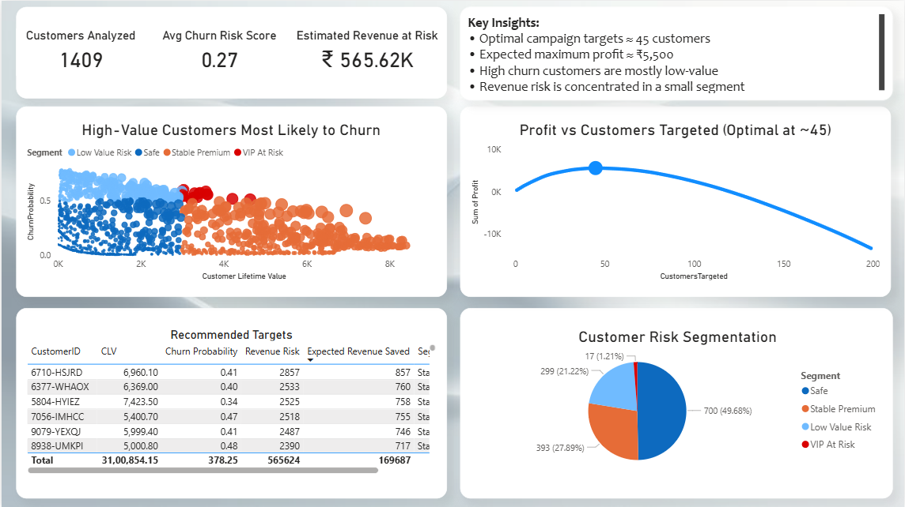
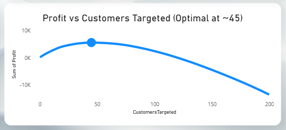

# Telecom Churn & Revenue Optimization System

[](https://www.python.org/)
[](https://scikit-learn.org/)
[](https://powerbi.microsoft.com/)

> **Project Mission:** Moving beyond standard machine learning classification to drive actionable, financially optimized business decisions.

##  Executive Summary
Most churn prediction projects focus only on identifying customers who are likely to leave.
In this project, I focus on a more practical question:
Which customers should actually be targeted to maximize business profit?
By combining churn probability with customer lifetime value (CLV), this project builds a system that not only predicts churn, but also helps prioritize retention efforts based on financial impact.

---

## The Business Problem & Solution

**The Problem:** Retaining customers is cheaper than acquiring new ones, but retention campaigns (e.g., offering a ₹500 discount) cost money. If a telecom company targets *every* predicted churner, they will lose money by offering discounts to low-value customers.

**The Solution:** 
*  Predict churn probability for each customer.
*  Multiply probability by Customer Lifetime Value (CLV) to find the **Revenue Risk**.
*  Simulate campaign costs against expected revenue saved to generate a **Profit Optimization Curve**.

---

## Key Business Outcomes

Instead of a generic accuracy metric, this model outputs actionable business intelligence:
* **Optimal Targeting:** The campaign should strictly target the top **~45 highest-risk, high-value customers**.
* **Maximum Profit:** Executing this optimized strategy yields a maximum net profit of **₹5,541**.
* **Risk Concentration:** The data revealed that the vast majority of churners are actually *low-value*. The true revenue risk is highly concentrated in a small "VIP" segment.
* **Model Performance:** Achieved an **ROC-AUC Score of 0.83**, providing a strong predictive foundation.

---

## Interactive Dashboard

The results of the predictive model and financial simulator are visualized in Power BI for stakeholder consumption.


| Full Executive Dashboard | Profit Optimization Curve |
|:---:|:---:|
|  |  |
| *High-level overview of revenue at risk and recommended targets.* | *Proves that targeting >50 customers results in financial loss.* |

---

## Why This Matters

In real-world scenarios, targeting all churners is inefficient and expensive.

This project shows that:
- A large portion of churn comes from low-value customers
- Only a small segment contributes to most of the revenue risk
- Optimizing targeting can significantly improve profitability

This shifts the focus from prediction accuracy to decision-making.

---

## Methodology

### Phase 1: Data Processing & Feature Engineering
* Handled missing values (`TotalCharges`) and encoded categorical variables.
* Engineered **CLV (Customer Lifetime Value)**: `MonthlyCharges × Tenure`.
* Created a `ServiceCount` feature to measure product stickiness.

### Phase 2: Predictive Modeling
* Trained a **Logistic Regression** model on an 80/20 train-test split.
* Evaluated performance using Precision, Recall, F1-Score, and ROC-AUC to handle class imbalances.

### Phase 3: Financial Simulation & Segmentation
* **Revenue Risk** = `Churn Probability × CLV`
* **Expected Revenue Saved** = `Churn Reduction Rate × Churn Probability × CLV`
* Segmented the customer base into four quadrants: *VIP At Risk, Stable Premium, Low Value Risk,* and *Safe*.
* Built a cumulative profit loop to output the exact point of diminishing returns for the marketing budget.

---

## 📂 Repository Structure

```text
churn-retention-optimization/
│
├── data/                   # Raw and processed datasets (telco.csv)
├── src/                    # Python scripts (data prep, model training, simulation)
├── outputs/                # Generated CSVs (predictions, profit_curve, BI_dataset)
├── dashboard/              # Power BI (.pbix) files
├── images/                 # Screenshots for README
└── README.md               # Project documentation
```
---
## How to Run This Project
### Clone the repository:
```
git clone https://github.com/Jerielphilly/churn-retention-optimization.git
```

### Install dependencies:
``` 
pip install pandas numpy scikit-learn
```

### Run the pipeline:
```
python src/train_model.py
```
This will train the model, run the financial simulation, and generate the necessary datasets in the outputs/ folder.

### View the Dashboard:
Open ```dashboard/churn_dashboard.pbix``` in Power BI Desktop and refresh the data source to view the results.

---

## Key Takeaway

Predicting churn is not enough — the real value comes from deciding who is worth saving.

---

## Author
Jeriel Philly 